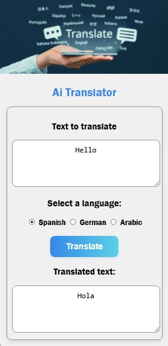

# 🌐 AI Translator

AI Translator is a simple, responsive web app that uses Google's Gemini API to translate user-inputted text into multiple languages using artificial intelligence.

## ✨ Features

- Translate text into **Spanish**, **German**, or **Arabic**
- Clean and minimal user interface
- Fast and accurate translations using AI
- Easy to customize and extend

## 📸 Demo

 <!-- Replace with an actual screenshot if available -->

## 🚀 Live Preview

> Coming soon (or host via GitHub Pages / Netlify)

## 🛠️ Tech Stack

- **HTML5**
- **CSS3**
- **Vanilla JavaScript**
- **OpenAI API**

## 🔧 Setup Instructions

### 1. Clone the Repository

```bash
git clone https://github.com/AminelMhl/AI-Translator.git
cd AI-Translator
```

### 2. Add Your OpenAI API Key

Create a `config.js` file in the root directory and add your key like this:

```js
// env.js
const GEMINI_API_KEY = "your-api-key-here";
```

> ⚠️ **Do not expose your API key in production!** This setup is only suitable for testing/demo purposes. For production, you must use a backend to securely store the API key.

### 3. Open `index.html` in Your Browser

You can double-click `index.html` or use a simple local server like:

```bash
npx serve
```

## 🌍 How to Use

1. Enter the text you want to translate.
2. Select a target language (Spanish, German, Arabic).
3. Click the **Translate** button.
4. View the translated text in the output box.

## 🧠 How It Works

- The app sends a request to Gemini's API with a translation prompt.
- The API responds with a translated version of the input text.
- The result is displayed instantly in the UI.

## 🛡️ Disclaimer

This is a frontend-only demo. API keys are exposed in `env.js` and should **not** be used in production. Use a backend server to keep your API key safe.

## 📄 License

MIT License. Feel free to use, modify, and share this project.

---

## 🙌 Acknowledgments

- [Google Ai Studio](https://aistudio.google.com) for the powerful Gemini free API
- [You](https://github.com/AminelMhl) for building the project
